# Jewelry POS System - Entity Relationship Diagram

## Database Schema Overview

This document provides a comprehensive view of the database schema for the Jewelry POS system.

---

## ERD Diagram (Mermaid)

```mermaid
erDiagram
    %% Core User Management
    APP_USER ||--o{ USER_ROLES : has
    ROLES ||--o{ USER_ROLES : has
    ROLES ||--o{ ROLE_PERMISSIONS : has
    PERMISSION ||--o{ ROLE_PERMISSIONS : has
    
    %% Sales and Products
    SALE ||--o{ SALE_ITEM : contains
    PRODUCT ||--o{ SALE_ITEM : "sold in"
    
    %% Old Gold (weak reference)
    SALE ||..o{ OLD_GOLD_PURCHASE : "may include"
    
    %% Scrap Management
    SCRAP_INVENTORY ||..o{ SCRAP_PURIFICATION : tracks
    
    %% Reference Data
    GOLD_RATE }o..|| SALE_ITEM : "rate applied to"

    APP_USER {
        string id PK "TSID"
        string firstName
        string lastName
        string username UK
        string password
        boolean enabled
        string createdBy
        datetime createdDate
        string lastModifiedBy
        datetime lastModifiedDate
    }

    ROLES {
        string id PK "TSID"
        string name UK "ROLE_ADMIN, ROLE_CLERK"
        string createdBy
        datetime createdDate
        string lastModifiedBy
        datetime lastModifiedDate
    }

    PERMISSION {
        string id PK "TSID"
        string name UK "PRODUCT_CREATE, SALE_VOID"
        string description
        string createdBy
        datetime createdDate
        string lastModifiedBy
        datetime lastModifiedDate
    }

    USER_ROLES {
        string user_id FK
        string role_id FK
    }

    ROLE_PERMISSIONS {
        string role_id FK
        string permission_id FK
    }

    PRODUCT {
        string id PK "TSID"
        string barcode UK "Indexed"
        string modelName
        enum purity "K24, K21, K18"
        decimal grossWeight "10,3"
        decimal makingCharge "10,2"
        integer version "Optimistic Lock"
        enum status "AVAILABLE, SOLD, RESERVED"
        decimal costPrice "12,2"
        string createdBy
        datetime createdDate
        string lastModifiedBy
        datetime lastModifiedDate
    }

    SALE {
        string id PK "TSID"
        string customerName
        string customerPhone
        datetime transactionDate
        decimal totalAmount "12,2"
        decimal oldGoldTotalValue "12,2"
        decimal netCashPaid "12,2"
        string createdBy
        datetime createdDate
        string lastModifiedBy
        datetime lastModifiedDate
    }

    SALE_ITEM {
        string id PK "TSID"
        string sale_id FK
        string product_id FK
        decimal appliedGoldRate "10,2"
        decimal weightSnapshot "10,3"
        decimal priceSnapshot "10,2"
        string createdBy
        datetime createdDate
        string lastModifiedBy
        datetime lastModifiedDate
    }

    OLD_GOLD_PURCHASE {
        string id PK "TSID"
        datetime transactionDate
        string karat "KARAT_21, KARAT_18"
        decimal weight "10,3"
        decimal buyRate "10,2"
        decimal totalValue "12,2"
        string saleId "Weak reference"
        string customerNationalId
        string description
        string createdBy
        datetime createdDate
        string lastModifiedBy
        datetime lastModifiedDate
    }

    GOLD_RATE {
        string id PK "TSID"
        decimal rate24k "10,2"
        decimal rate21k "10,2"
        decimal rate18k "10,2"
        datetime effectiveDate
        boolean active
        string createdBy
        datetime createdDate
        string lastModifiedBy
        datetime lastModifiedDate
    }

    SCRAP_INVENTORY {
        string karat PK "KARAT_21, KARAT_18"
        decimal totalWeight "12,3"
    }

    SCRAP_PURIFICATION {
        string id PK "TSID"
        datetime transactionDate
        string karat "KARAT_21, KARAT_18"
        decimal weightOut "10,3"
        decimal cashReceived "12,2"
        string factoryName
        string createdBy
        datetime createdDate
        string lastModifiedBy
        datetime lastModifiedDate
    }

    SYSTEM_SETTING {
        string key PK "setting_key"
        string value "setting_value"
    }
```



---

## Entity Details

### 1. **User Management Domain**

#### `app_user`
- **Purpose**: Store user accounts for system access
- **Key Features**: 
  - TSID primary key for distributed systems
  - Unique username constraint
  - Audit trail (created/modified by/date)
  - Many-to-Many with Roles

#### `roles`
- **Purpose**: Define user roles (ROLE_ADMIN, ROLE_CLERK, etc.)
- **Key Features**:
  - Many-to-Many with Users and Permissions
  - Eager fetching for security context

#### `permission`
- **Purpose**: Granular permissions (PRODUCT_CREATE, SALE_VOID, etc.)
- **Key Features**:
  - Unique permission names
  - Linked to roles for RBAC

#### `user_roles` (Join Table)
- Links users to their assigned roles

#### `role_permissions` (Join Table)
- Links roles to their granted permissions

---

### 2. **Inventory Domain**

#### `product`
- **Purpose**: Jewelry inventory items
- **Key Features**:
  - Unique barcode with index for fast lookups
  - Purity enum (K24, K21, K18)
  - Status tracking (AVAILABLE, SOLD, RESERVED)
  - **Optimistic locking** via `@Version` for concurrent updates
  - Cost price tracking

---

### 3. **Sales Domain**

#### `sale`
- **Purpose**: Sales transactions
- **Key Features**:
  - Customer information (optional)
  - Total amount calculation
  - Old gold trade-in support (`oldGoldTotalValue`)
  - Net cash paid after trade-in deduction
  - One-to-Many with SaleItems (cascade all, orphan removal)

#### `sale_item`
- **Purpose**: Line items in a sale
- **Key Features**:
  - Links to Product and Sale
  - Snapshots: weight, price, gold rate (immutable history)
  - Lazy loading for performance

---

### 4. **Gold Management Domain**

#### `gold_rate`
- **Purpose**: Historical gold pricing by karat
- **Key Features**:
  - Rates for 24K, 21K, 18K
  - Effective date tracking
  - Active flag for current rate

#### `old_gold_purchase`
- **Purpose**: Track old gold trade-ins
- **Key Features**:
  - Karat specification
  - Weight and buy rate
  - **Weak reference** to Sale (string `saleId`, not FK)
  - Customer national ID for compliance
  - Can be standalone cash purchase (null saleId)

---

### 5. **Scrap Management Domain**

#### `scrap_inventory`
- **Purpose**: Aggregate scrap gold by karat
- **Key Features**:
  - Karat as primary key (KARAT_21, KARAT_18)
  - Total weight tracking
  - No audit fields (aggregate data)

#### `scrap_purification`
- **Purpose**: Track purification transactions
- **Key Features**:
  - Weight sent out for purification
  - Cash received from factory
  - Factory name tracking

---

### 6. **Configuration Domain**

#### `system_setting`
- **Purpose**: Key-value configuration store
- **Key Features**:
  - Simple key-value pairs
  - No audit fields (configuration data)

---

## Relationship Types

| Relationship | Type | Cardinality | Join Table | Cascade |
|-------------|------|-------------|------------|---------|
| AppUser ↔ Role | Many-to-Many | N:M | `user_roles` | No |
| Role ↔ Permission | Many-to-Many | N:M | `role_permissions` | No |
| Sale → SaleItem | One-to-Many | 1:N | - | ALL + Orphan Removal |
| SaleItem → Product | Many-to-One | N:1 | - | No |
| SaleItem → Sale | Many-to-One | N:1 | - | No |
| OldGoldPurchase → Sale | Weak Reference | N:1 | - | No (String only) |
| ScrapInventory ↔ ScrapPurification | Logical | - | - | No (via karat) |

---

## Key Design Patterns

### 1. **TSID (Time-Sorted ID)**
- All entities use TSID for primary keys
- Benefits: Distributed system support, chronological ordering, no collisions

### 2. **Auditable Base Class**
- Most entities extend `Auditable`
- Automatic tracking: `createdBy`, `createdDate`, `lastModifiedBy`, `lastModifiedDate`
- Exceptions: `ScrapInventory`, `SystemSetting` (aggregate/config data)

### 3. **Optimistic Locking**
- `Product` entity uses `@Version` field
- Prevents concurrent update conflicts

### 4. **Snapshot Pattern**
- `SaleItem` stores snapshots of price, weight, and gold rate
- Ensures historical accuracy even if product/rates change

### 5. **Soft References**
- `OldGoldPurchase.saleId` uses String instead of FK
- Allows flexibility for standalone purchases

---

## Indexes

| Table | Column | Type | Purpose |
|-------|--------|------|---------|
| `product` | `barcode` | B-Tree | Fast product lookup during sales |
| `app_user` | `username` | Unique | Authentication |
| `roles` | `name` | Unique | Role lookup |
| `permission` | `name` | Unique | Permission lookup |

---

## Constraints

### Unique Constraints
- `app_user.username`
- `product.barcode`
- `roles.name`
- `permission.name`

### Not Null Constraints
- All primary keys
- User credentials (`firstName`, `lastName`, `username`, `password`)
- Product status and cost price
- Sale amounts and dates
- Gold rates and effective dates
- Transaction dates across all transactional entities

---

## Data Types & Precision

| Field Type | Precision | Usage |
|-----------|-----------|-------|
| Weight | `DECIMAL(10,3)` | 3 decimal places for gram precision |
| Price/Amount | `DECIMAL(10,2)` or `DECIMAL(12,2)` | 2 decimal places for currency |
| Gold Rate | `DECIMAL(10,2)` | 2 decimal places for rate per gram |
| IDs | `VARCHAR(26)` | TSID format |

---

## Business Rules Enforced by Schema

1. **Product Uniqueness**: Each product has a unique barcode
2. **User Authentication**: Username must be unique
3. **Sale Integrity**: SaleItems cascade delete with Sale (orphan removal)
4. **Audit Trail**: Most entities track who created/modified and when
5. **Optimistic Locking**: Products use version control to prevent conflicts
6. **Historical Accuracy**: SaleItems snapshot prices/weights at time of sale
7. **Trade-in Support**: Sales can include old gold value deduction
8. **Scrap Tracking**: Karat-based inventory and purification tracking

---

## Notes

- **Enums are stored as strings** in the database (not ordinals)
- **Lazy loading** used for SaleItem relationships to optimize performance
- **Eager loading** used for security-related entities (Role, Permission)
- **Cascade operations** only on Sale → SaleItem (parent-child relationship)
- **No physical FK** from OldGoldPurchase to Sale (design choice for flexibility)

---

## Database Diagram Legend

```
||--o{ : One to Many
}o--o{ : Many to Many
||..o{ : One to Many (weak/logical reference)
```

---

*Generated on: 2026-01-22*
*Database: Jewelry POS System*
*ORM: JPA/Hibernate*
